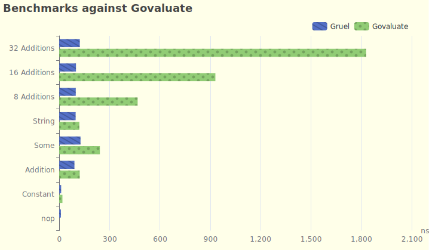

# Gruel - JIT Rule Engine for Go

Gruel is an experimental rule engine for Go that uses [LibJIT] to compile
the rules into machine code to maximize the performance. See
[operators.go](./internal/ir/operators.go) for supported operators.

Practically speaking, no application will have a bottleneck in its rule engine,
so this library is more an experiment than a real "engine" thing.
(Notice that most operations below just cost dozens of nanoseconds for both
Gruel and [Govaluate].)

[Govaluate]: https://github.com/Knetic/govaluate

<!--
Graph plotted with Apache Echarts:

option = {
  title: {
    text: 'Benchmarks against Govaluate'
  },
  tooltip: {
    trigger: 'axis',
    axisPointer: {
      type: 'shadow'
    }
  },
  legend: {},
  grid: {
    left: '3%',
    right: '4%',
    bottom: '3%',
    containLabel: true
  },
  xAxis: {
    name: 'ns',
    type: 'value',
    boundaryGap: [0, 0.01]
  },
  yAxis: {
    type: 'category',
    data: ['nop', 'Constant', 'Addition', 'Some', 'String',
    '8 Additions', '16 Additions', '32 Additions']
  },
  series: [
    {
      name: 'Gruel',
      type: 'bar',
      data: [
        10.15,
        11.59,
        90.70,
        126.9,
        97.86,
        98.60,
        99.83,
        122.7,
      ],
    },
    {
      name: 'Govaluate',
      type: 'bar',
      data: [
        0,
        19.18,
        122.2,
        242.2,
        119.8,
        467.1,
        930.0,
        1828,
      ],
    }
  ]
};

-->

It is inspired by [rustgo: calling Rust from Go with near-zero overhead]
to minimize the performance cost of calling C functions.

[LibJit]: https://www.gnu.org/software/libjit/
[rustgo: calling Rust from Go with near-zero overhead]: https://words.filippo.io/rustgo/

## Mechanism

- Parsing:

  The language is lisp-like as I just don't want to waste too much time on a parser.

- Compiling:

  The AST is compiled into a stack-based IR, which is then passed to C code.
  The C code (with CGO) compiles the IR with LibJIT into real machine code.

- Running: (the experimental part)

  We are going to call a function pointer without CGO. Since Go has a different
  ABI, one has to use some assembly to:

  - convert the ABI, align the stack pointer, and
  - make sure that the stack doesn't overflow with `runtime.morestack_noctxt`.

## License

LibJIT is licensed under [LGPL] and [so do we](./LICENSE).

[LGPL]: https://www.gnu.org/licenses/old-licenses/lgpl-2.1.html

But if you can ever get the thing run with dynamically linked LibJIT,
I suppose you are free to use the code with a [MPL2](./LICENSE.MPL2) license.
